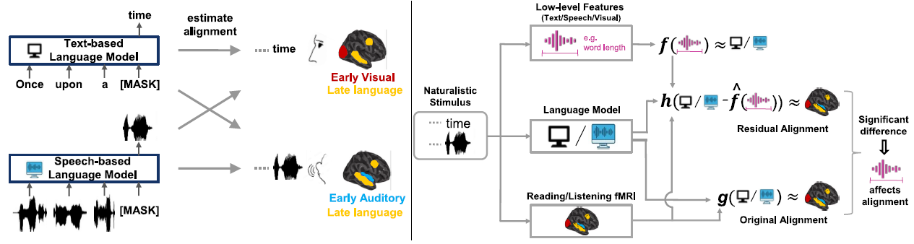

# Speech language models lack important brain relevant semantics

[Speech language models lack important brain relevant semantics](https://arxiv.org/pdf/2311.04664), Subba Reddy Oota, Emin Çelik, Fatma Deniz and Mariya Toneva, ACL-2024



**Subset-Moth-Radio-Hour dataset statistics:**

Link: https://gin.g-node.org/denizenslab/narratives_reading_listening_fmri
- 6 subjects
- fMRI brain recordings
- 11 stories (10 stories for training + 1 story for testing)
- TR = 2.0045 secs
- subjects: ['01', '02', '03', '05', '07', '08']
- stimuli-folder: https://gin.g-node.org/denizenslab/narratives_reading_listening_fmri/src/master/stimuli
- mappers: https://gin.g-node.org/denizenslab/narratives_reading_listening_fmri/src/master/mappers

**Predict brain recordings using language model representations (Reading and Listening):**

- sub_number [1, 2, 3, 5, 7, 8]
- stimulus vector [bert, gpt-2, FLAN]
- modality [reading, listening]
- output_dir
- #num of layers [12, 24]

**How to estimate cross-subject prediction accuracy**
- Please refer Noise_Celing estimate folder: Noise_Ceiling/readme.MD

**How to extract text- and speech-based stimuli representations**
- Text transcripts are present in the folder: Feature_Extraction/stories_txt
- Speech (.wav) files are present in the folder: Feature_Extraction/stories_wav
- Instructions are provided in readme.MD file: Feature_Extraction/readme.MD

**Build encoding models**

*Text-based models*
```
python brain_predictions_text.py 1 bert-subset-moth-radio.npy reading bert-predictions 12
python brain_predictions_text.py 1 bert-subset-moth-radio.npy listening bert-predictions 12
```

*Speech-based models*
```
python brain_predictions_speech.py 1 wav2vec-base reading wav2vec-predictions 12
python brain_predictions_speech.py 1 wav2vec-base listening wav2vec-predictions 12
```
**Build residual-based encoding models**

To build encoding models for residuals, download the following files and save it to folder: Low-level-features
- features_matrix.hdf: https://gin.g-node.org/gallantlab/story_listening/src/master/features 
- features_trn_NEW.hdf and features_val_NEW.hdf
- Refer the Brain_preditictions/brain_predictions_residuals.py file consists of low-level feature names
  
```
python brain_predictions_residuals.py 1 bert-subset-moth-radio-downsampled.npy reading bert-predictions 0 articulation
python brain_predictions_residuals.py 1 bert-subset-moth-radio-downsampled.npy listening bert-predictions 0 articulation
```

## For Citation of our work
```
@inproceedings{oota2024speech,
  title={Speech language models lack important brain relevant semantics},
  author={Oota, Subba Reddy and Çelik, Emin and Deniz, Fatma and Toneva, Mariya},
  booktitle={ACL},
  year={2024}
}
```
